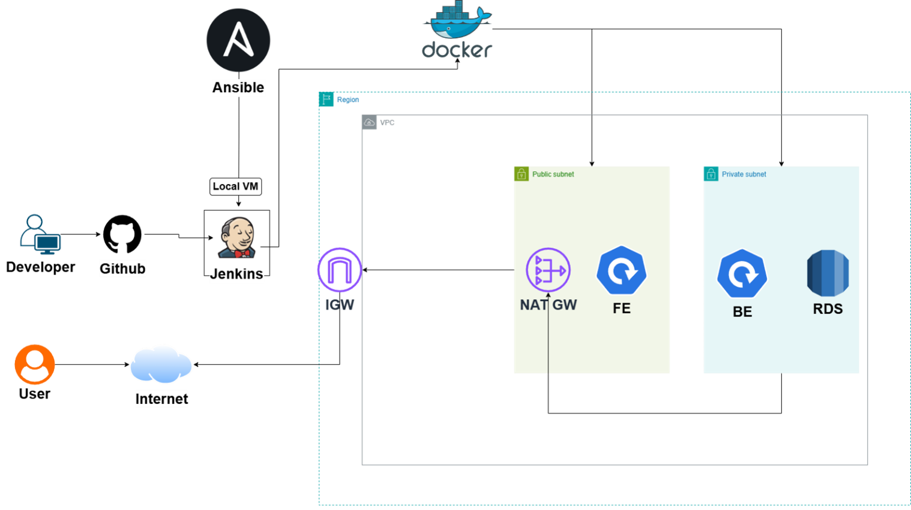
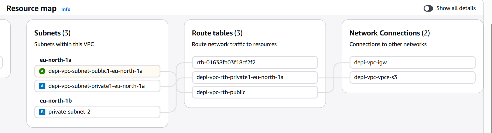
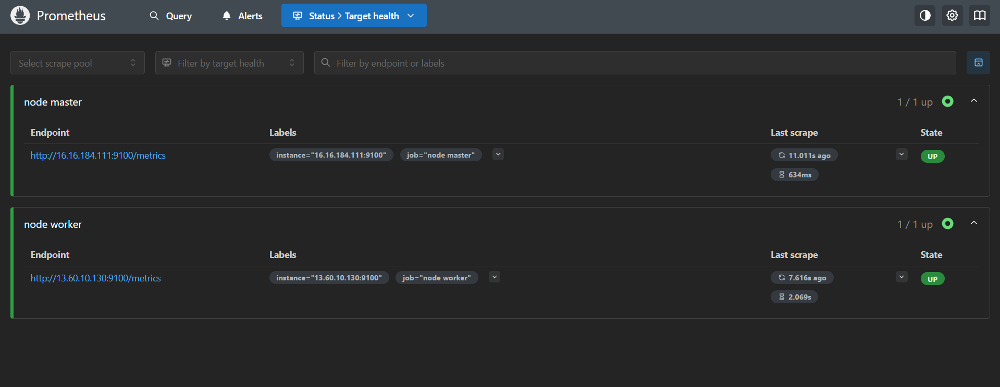

#  DEPI DevOps Graduation Project

> A full end-to-end DevOps pipeline for a containerized Notes web application — from infrastructure provisioning on AWS to deployment on a Kubernetes cluster, with full CI/CD automation and observability.

---

## 📋 Table of Contents

- [Project Overview](#-project-overview)
- [Architecture](#-architecture)
- [Tech Stack](#-tech-stack)
- [Project Structure](#-project-structure)
- [Infrastructure (Terraform)](#-infrastructure-terraform)
- [Configuration Management (Ansible)](#-configuration-management-ansible)
- [Application](#-application)
- [Containerization (Docker)](#-containerization-docker)
- [CI/CD Pipeline (Jenkins)](#-cicd-pipeline-jenkins)
- [Kubernetes Deployment (K3s)](#-kubernetes-deployment-k3s)
- [Monitoring (Prometheus & Grafana)](#-monitoring-prometheus--grafana)
- [Screenshots](#-screenshots)
- [Getting Started](#-getting-started)

---

##  Project Overview

This project demonstrates a complete **DevOps workflow** for a **Notes CRUD Web Application**, covering:

- **Infrastructure as Code** with Terraform on AWS (VPC, EC2, RDS, NAT Gateway, Security Groups, Secrets Manager)
- **Configuration Management** with Ansible (Jenkins installation and configuration)
- **Containerization** with Docker (multi-service: frontend, backend, PostgreSQL)
- **CI/CD Pipeline** with Jenkins (automated build, tag, push to Docker Hub)
- **Container Orchestration** with K3s (lightweight Kubernetes) deploying to AWS
- **Monitoring & Alerting** with Prometheus and Grafana

---

## 🏗 Architecture



The infrastructure spans an AWS VPC (`10.0.0.0/16`) in **eu-north-1** with the following layout:

| Subnet Type | CIDRs | Purpose |
|---|---|---|
| Public | `10.0.11.0/24`, `10.0.12.0/24` | Bastion / NAT Gateway |
| Private | `10.0.101.0/24`, `10.0.102.0/24` | Application (K3s nodes) |
| DB | `10.0.201.0/24`, `10.0.202.0/24` | Amazon RDS PostgreSQL |

**Traffic flow:**
```
Internet → IGW → Public Subnet (Bastion / Jenkins)
                         ↓
              Private Subnet (K3s cluster)
                         ↓
                 DB Subnet (RDS PostgreSQL)
```

---

## 🛠 Tech Stack

| Category | Tool / Service |
|---|---|
| Cloud Provider | AWS (EC2, RDS, VPC, Secrets Manager) |
| IaC | Terraform |
| Configuration Mgmt | Ansible |
| CI/CD | Jenkins |
| Containerization | Docker, Docker Compose |
| Container Registry | Docker Hub & AWS ECR |
| Orchestration | K3s (lightweight Kubernetes) |
| Backend | Node.js + Express |
| Frontend | React (Vite) |
| Database | PostgreSQL (local Docker & AWS RDS) |
| Monitoring | Prometheus + Grafana + Alertmanager |

---

## 📁 Project Structure

```
.
├── Ansible/                    # Ansible playbooks & roles
│   ├── ansible.cfg
│   ├── site.yml                # Main playbook (Jenkins install)
│   ├── group_vars/             # Variables & vault secrets
│   └── roles/
│       └── jenkins/            # Jenkins role tasks
│
├── Terraform/                  # AWS infrastructure as code
│   ├── provider.tf
│   ├── vpc.tf                  # VPC, subnets, IGW, NAT, route tables
│   ├── ec2.tf                  # Bastion EC2 instance
│   ├── rds.tf                  # PostgreSQL RDS + Secrets Manager
│   ├── security_groups.tf      # Security group rules
│   ├── variables.tf
│   ├── outputs.tf
│   └── versions.tf
│
├── K3s/                        # Kubernetes manifests
│   ├── namespace.yaml
│   ├── backend-deployment.yaml
│   ├── backend-service.yaml
│   ├── frontend-deployment.yaml
│   ├── frontend-service.yaml
│   └── igress.yaml             # Ingress rules
│
├── backend/                    # Node.js REST API
│   ├── Dockerfile
│   ├── index.js
│   └── package.json
│
├── frontend/                   # React frontend
│   ├── dockerfile
│   ├── index.html
│   └── src/
│
├── prometheus/                 # Monitoring stack
│   ├── docker-compose.yaml
│   ├── prom_files/
│   └── alertmanager/
│
├── assets/                     # Project screenshots & diagrams
│
├── docker-compose.yml          # Local development stack
└── Jenkinsfile                 # CI/CD pipeline definition
```

---

## ☁️ Infrastructure (Terraform)

Terraform is used to provision all AWS infrastructure from scratch.

### Resources Created

- **VPC** (`10.0.0.0/16`) with DNS hostnames & support enabled
- **Public Subnets** × 2 — with Internet Gateway and public route table
- **Private Subnets** × 2 — routed through NAT Gateway
- **DB Subnets** × 2 — isolated, no internet access
- **NAT Gateway** — with Elastic IP for outbound private subnet traffic
- **Bastion EC2 Instance** — Ubuntu 22.04 ARM64, used as jump host / Jenkins server
- **RDS PostgreSQL 16** — private, `db.t4g.micro`, 20 GB gp2, 7-day backups
- **AWS Secrets Manager** — auto-generated DB password stored securely
- **Security Groups** — bastion, application, and DB layers

### Usage

```bash
cd Terraform/
terraform init
terraform plan
terraform apply
```

> ⚠️ Requires AWS credentials configured via `aws configure` or environment variables. A `terraform.tfvars` file is gitignored — create your own from `variables.tf`.

**Terraform Init:**


**Terraform Plan:**


**AWS VPC:**



---

## ⚙️ Configuration Management (Ansible)

Ansible is used to configure the EC2 bastion host — primarily to install and set up **Jenkins**.

```bash
cd Ansible/
ansible-playbook site.yml --ask-vault-pass
```

- **`site.yml`** — targets the `jenkins` host group
- **`roles/jenkins/`** — handles Java, Jenkins installation, and initial configuration
- **`group_vars/vault.yml`** — Ansible Vault encrypted secrets (credentials, tokens)

**Ansible Playbook Output:**


---

## 💻 Application

A simple **Notes CRUD application** with:

| Component | Tech | Port |
|---|---|---|
| Frontend | React (Vite) | 8080 |
| Backend | Node.js + Express | 5000 |
| Database | PostgreSQL | 5432 |

### Backend API Endpoints

| Method | Endpoint | Description |
|---|---|---|
| `GET` | `/api/hello` | Health check |
| `GET` | `/api/notes` | Fetch all notes |
| `POST` | `/api/notes` | Create a note (`{ title, body }`) |
| `DELETE` | `/api/notes/:id` | Delete a note by ID |

**Notes App:**


---

## 🐳 Containerization (Docker)

### Local Development

Run the full stack locally with Docker Compose:

```bash
docker-compose up --build
```

| Service | Image | Exposed Port |
|---|---|---|
| `db` | `postgres:15` | 5432 |
| `backend` | built from `./backend` | 5000 |
| `frontend` | built from `./frontend` | 8082 → 8080 |

### Dockerfiles

- **Backend** — Node.js app, copies `package.json`, runs `npm install`, starts `index.js`
- **Frontend** — React app, built with Vite, served via a static server

---

## 🔄 CI/CD Pipeline (Jenkins)

The Jenkins pipeline is defined in [`Jenkinsfile`](Jenkinsfile) and automates the full build-and-push workflow.

### Pipeline Stages

```
Checkout → Prepare Tags → Build Backend → Build Frontend
        → Login to Docker Hub → Push Images → Cleanup → Post Actions
```

| Stage | Description |
|---|---|
| **Checkout** | Pulls latest code from `main` branch on GitHub |
| **Prepare Tags** | Generates image tags using short Git commit SHA + `latest` |
| **Build Backend** | `docker build` for `nasser1tarek/depi_backend` |
| **Build Frontend** | `docker build` for `nasser1tarek/depi_frontend` |
| **Login** | Authenticates to Docker Hub using Jenkins credentials store |
| **Push Images** | Pushes both `:<sha>` and `:latest` tags |
| **Cleanup** | Removes local images to free disk space |

### Docker Hub Images

- [`nasser1tarek/depi_backend`](https://hub.docker.com/r/nasser1tarek/depi_backend)
- [`nasser1tarek/depi_frontend`](https://hub.docker.com/r/nasser1tarek/depi_frontend)

---

## ☸️ Kubernetes Deployment (K3s)

The application is deployed on a **K3s** (lightweight Kubernetes) cluster running on AWS private EC2 instances.

### Manifests

| File | Description |
|---|---|
| `namespace.yaml` | Creates `depi` namespace |
| `backend-deployment.yaml` | Backend deployment (pulls from AWS ECR), with readiness/liveness probes |
| `backend-service.yaml` | ClusterIP service for backend |
| `frontend-deployment.yaml` | Frontend deployment |
| `frontend-service.yaml` | ClusterIP service for frontend |
| `igress.yaml` | Ingress routing rules |

### Deploy to Cluster

```bash
kubectl apply -f K3s/namespace.yaml
kubectl apply -f K3s/
```

### Key Features

- **DB credentials** injected via Kubernetes `Secret` (`depi-db-secret`) — sourced from AWS Secrets Manager
- **ECR image** pull using `ecr-registry-key` imagePullSecret
- **Readiness & Liveness probes** on `/api/hello` endpoint
- **Ingress** for external traffic routing

---

## 📊 Monitoring (Prometheus & Grafana)

The monitoring stack is deployed via Docker Compose inside the `prometheus/` directory.

```bash
cd prometheus/
docker-compose up -d
```

### Components

| Service | Description |
|---|---|
| **Prometheus** | Metrics scraping and storage |
| **Grafana** | Dashboards and visualization |
| **Alertmanager** | Alert routing and notifications |

**Prometheus Dashboard:**



---

## 📸 Screenshots

| Description | Preview |
|---|---|
| Architecture Diagram |  |
| AWS VPC |  |
| Terraform Init |  |
| Terraform Plan |  |
| Ansible Playbook |  |
| Notes App |  |
| Prometheus |  |

---

## 🚦 Getting Started

### Prerequisites

- AWS account with CLI configured (`aws configure`)
- Terraform ≥ 1.5
- Ansible ≥ 2.14
- Docker & Docker Compose
- `kubectl` (for K3s interaction)

### Quick Start

```bash
# 1. Clone the repository
git clone https://github.com/nasser-tarek/Depi_project.git
cd Depi_project

# 2. Provision AWS infrastructure
cd Terraform && terraform init && terraform apply

# 3. Configure EC2 with Ansible
cd ../Ansible && ansible-playbook site.yml --ask-vault-pass

# 4. Run locally with Docker Compose
cd .. && docker-compose up --build

# 5. Deploy to K3s
kubectl apply -f K3s/
```

---

## 👤 Author

**Nasser Tarek**
- GitHub: [@nasser-tarek](https://github.com/nasser-tarek)
- Docker Hub: [nasser1tarek](https://hub.docker.com/u/nasser1tarek)

---

## 📄 License

This project was developed as a graduation project for the **Digital Egypt Pioneers Initiative (DEPI)** — DevOps Track.
